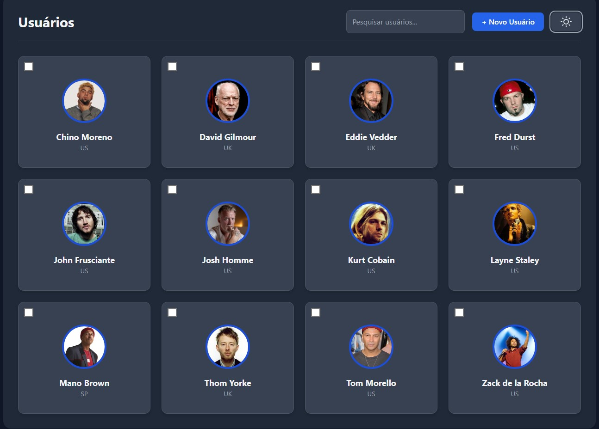
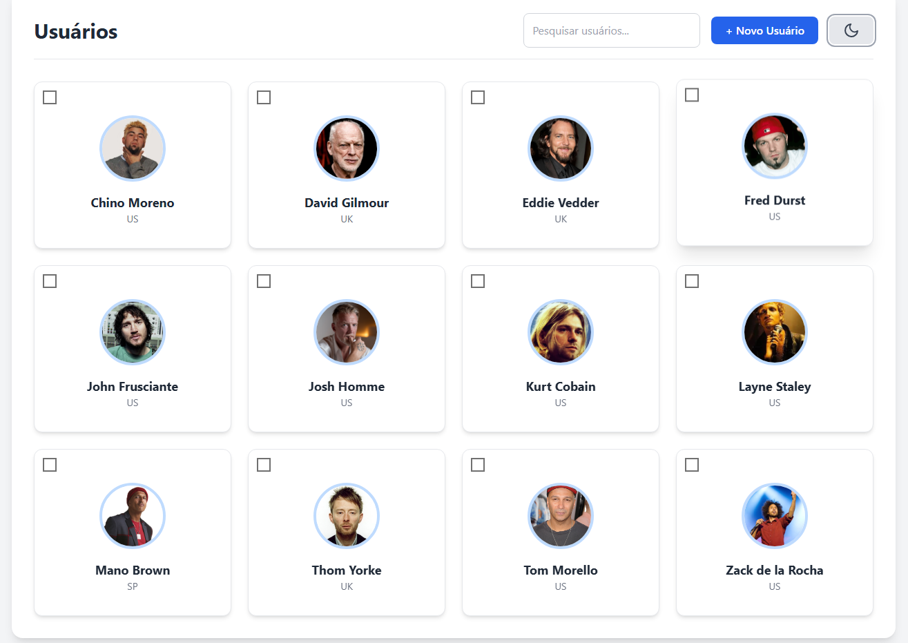
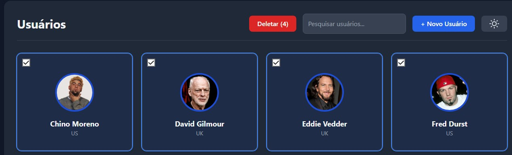
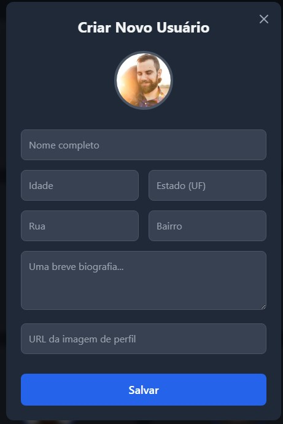
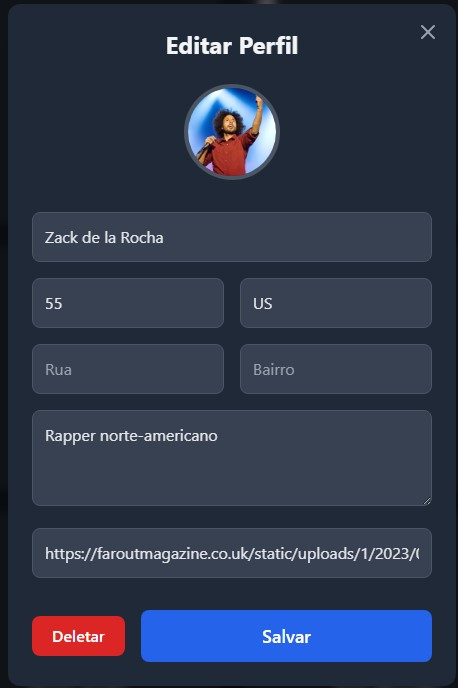

# Desafio Técnico Sync360

Este projeto é uma solução para o desafio técnico proposto pela Sync360.io, consistindo em uma aplicação web Full Stack para criar, visualizar, editar e deletar perfis de usuários.

A interface foi desenvolvida com foco em uma experiência de usuário limpa, responsiva e moderna, incluindo funcionalidades como tema claro/escuro e design minimalista.

---

### **[Clique aqui para ver o projeto online](https://davi-sync360.vercel.app)**

---

## ✨ Funcionalidades

- **Listagem de Usuários**: Visualização de todos os perfis em formato de cartões.
- **Criação de Usuários**: Formulário para adicionar novos perfis ao banco de dados.
- **Edição de Usuários**: Modal para alterar todas as informações de um perfil existente.
- **Deleção de Usuários**: Opção para remover um usuário do sistema (com confirmação).
- **Interface Responsiva**: Layout adaptável para desktops, tablets e smartphones.
- **Tema Claro e Escuro**: Botão para alternar entre os temas, com persistência da escolha do usuário.

  
  

## 🛠️ Tecnologias Utilizadas

#### **Frontend**

- **React**: Biblioteca para construção da interface de usuário.
- **Tailwind CSS**: Framework CSS para estilização rápida e responsiva.
- **HTML5**: Estrutura da página.

#### **Backend**

- **PHP**: Linguagem para a lógica do servidor e API.
- **MySQL**: Banco de dados para armazenamento dos perfis.
- **PDO**: Extensão para conexão segura com o banco de dados.

## 🚀 Como Executar o Projeto Localmente

Para rodar este projeto, você precisará de um ambiente de servidor local como XAMPP ou MAMP.

### Pré-requisitos

- Um servidor web com suporte a PHP e MySQL (XAMPP, MAMP, WAMP, etc.).
- Um navegador web moderno (Chrome, Firefox, Edge).
- VS Code com a extensão **Live Server** (recomendado).

### Passo a Passo

#### 1. Backend

1.  Clone este repositório: `git clone https://github.com/nerdavi/sync360.git`
2.  Copie os arquivos da pasta `backend` (`config.php`, `listar_usuarios.php`, etc.) para o diretório `htdocs` do seu servidor XAMPP (ex: `C:/xampp/htdocs/backend`).
3.  Abra o **phpMyAdmin** (geralmente em `http://localhost/phpmyadmin`).
4.  Crie um novo banco de dados chamado `usuarios_db`.
5.  Selecione o banco `usuarios_db` e vá para a aba "SQL". Cole o conteúdo do arquivo `banco.sql` e execute para criar a tabela e inserir o primeiro usuário.
6.  Verifique se as credenciais em `config.php` (`"root"`, `""`) correspondem às do seu ambiente.

#### 2. Frontend

1.  Abra a pasta do projeto no VS Code.
2.  Abra o arquivo `app.js`.
3.  **IMPORTANTE**: Na linha `const API_URL = '...';`, altere a URL para o caminho da sua pasta de backend. Ex: `const API_URL = 'http://localhost/backend/';`.
4.  Clique com o botão direito no arquivo `index.html` e selecione "Open with Live Server".

Pronto! A aplicação deve abrir no seu navegador e carregar os dados do seu banco de dados local.

## 🌐 Deploy

- O **Frontend** foi hospedado na **Vercel**, integrado diretamente com este repositório GitHub.
- O **Backend** (API em PHP e banco de dados MySQL) foi hospedado localmente.

---
